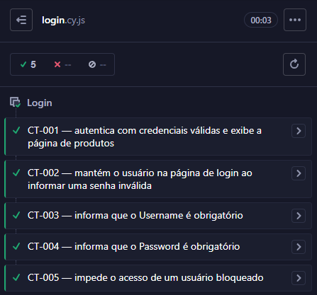
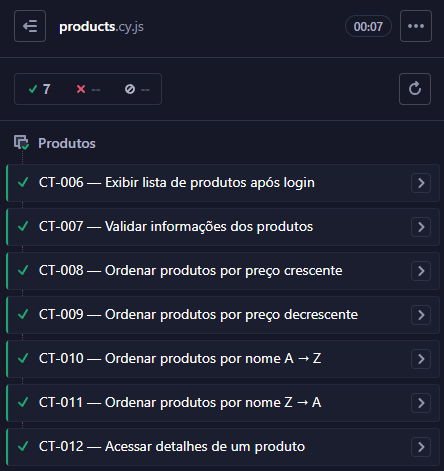

# 🧪 SauceDemo — Projeto de Automação de Testes

Projeto de Quality Assurance desenvolvido para praticar **planejamento, documentação, execução e automação de testes** utilizando a aplicação SauceDemo.

O projeto está sendo desenvolvido de forma incremental, iniciando pela análise das funcionalidades e documentação dos casos de teste, seguida pela implementação das automações com Cypress, execução dos testes e registro das evidências.

---

## 📌 Sobre o Projeto

O [SauceDemo](https://www.saucedemo.com/) é uma aplicação web que simula um e-commerce e disponibiliza funcionalidades como:

- Autenticação;
- Catálogo de produtos;
- Ordenação de produtos;
- Detalhes de produtos;
- Carrinho;
- Checkout.

O projeto é utilizado como ambiente de estudo para aplicar conceitos e práticas utilizadas na área de **Quality Assurance e Automação de Testes**.

---

## 🎯 Objetivos

Aplicar e demonstrar conhecimentos relacionados a:

- Planejamento de testes;
- Criação e documentação de casos de teste;
- Testes positivos e negativos;
- Testes funcionais;
- Testes exploratórios;
- Testes End-to-End (E2E);
- Automação de testes com Cypress;
- Assertions;
- Seletores;
- Hooks;
- Validação de dados;
- Registro de evidências;
- Refatoração de testes;
- Versionamento com Git e GitHub.

---

## 🌐 Aplicação Testada

**Aplicação:** SauceDemo  
**URL:** https://www.saucedemo.com/

---

## 🛠️ Tecnologias e Ferramentas

- Cypress
- JavaScript
- Node.js
- npm
- Git
- GitHub
- Visual Studio Code
- Codex

---

## 📂 Estrutura do Projeto

```text
SauceDemo/
│
├── cypress/
│   ├── e2e/
│   │   ├── login.cy.js
│   │   ├── products.cy.js
│   │   ├── cart.cy.js
│   │   └── checkout.cy.js
│   │
│   ├── fixtures/
│   └── support/
│
├── Docs/
│   ├── casos-de-teste.md
│   └── plano-de-testes.md
│
├── Evidencias/
│   ├── Login/
│   │   └── login-testes-aprovados.png
│   │
│   └── Produtos/
│       └── produtos-testes-aprovados.png
│
├── .gitignore
├── cypress.config.js
├── package.json
├── package-lock.json
└── README.md
```

> A pasta `node_modules` existe apenas no ambiente local e não é versionada no repositório.

---

## 📚 Documentação

A documentação utilizada no projeto pode ser acessada diretamente pelos links abaixo:

- 📋 [Casos de Teste](./Docs/casos-de-teste.md)
- 📑 [Plano de Testes](./Docs/plano-de-testes.md)
- 📸 [Evidências](./Evidencias/)
- 🤖 [Testes Automatizados](./cypress/e2e/)

---

# 🧪 Testes Automatizados

Atualmente o projeto possui:

**12 testes automatizados executados com sucesso. ✅**

| Módulo | Casos | Resultado |
|---|---:|---|
| 🔐 Login | 5 | ✅ 5/5 |
| 📦 Produtos | 7 | ✅ 7/7 |
| **Total** | **12** | **✅ 12/12** |

---

# 🔐 Módulo de Login

O primeiro módulo desenvolvido foi o fluxo de autenticação da aplicação.

Foram documentados e automatizados cinco cenários de teste.

## Casos de Teste

| ID | Cenário | Tipo | Resultado |
|---|---|---|---|
| CT-001 | Login com credenciais válidas | Positivo | ✅ Aprovado |
| CT-002 | Login com senha inválida | Negativo | ✅ Aprovado |
| CT-003 | Login sem informar usuário | Negativo | ✅ Aprovado |
| CT-004 | Login sem informar senha | Negativo | ✅ Aprovado |
| CT-005 | Login com usuário bloqueado | Negativo | ✅ Aprovado |

**Resultado: 5/5 testes aprovados. ✅**

### 🔎 Validações realizadas

Durante os testes de Login foram realizadas validações relacionadas a:

- Autenticação com credenciais válidas;
- Redirecionamento para a página de produtos;
- Carregamento da lista de produtos após autenticação;
- Permanência na página de Login após tentativas inválidas;
- Mensagens de erro;
- Campos obrigatórios;
- Bloqueio de acesso para usuário bloqueado.

### 🤖 Automação

➡️ [Ver `login.cy.js`](./cypress/e2e/login.cy.js)

---

# 📦 Módulo de Produtos

O segundo módulo desenvolvido foi a página de produtos apresentada após a autenticação.

Foram documentados e automatizados sete cenários relacionados à exibição, integridade das informações, ordenação e detalhes dos produtos.

## Casos de Teste

| ID | Cenário | Tipo | Resultado |
|---|---|---|---|
| CT-006 | Exibir lista de produtos após login | Positivo | ✅ Aprovado |
| CT-007 | Validar informações dos produtos | Positivo | ✅ Aprovado |
| CT-008 | Ordenar produtos por preço crescente | Positivo | ✅ Aprovado |
| CT-009 | Ordenar produtos por preço decrescente | Positivo | ✅ Aprovado |
| CT-010 | Ordenar produtos por nome A → Z | Positivo | ✅ Aprovado |
| CT-011 | Ordenar produtos por nome Z → A | Positivo | ✅ Aprovado |
| CT-012 | Acessar detalhes de um produto | Positivo | ✅ Aprovado |

**Resultado: 7/7 testes aprovados. ✅**

### 🔎 Validações realizadas

Durante os testes de Produtos foram realizadas validações relacionadas a:

- Exibição da página de produtos após autenticação;
- Existência da lista de produtos;
- Existência de produtos na listagem;
- Nome dos produtos;
- Descrição dos produtos;
- Preço dos produtos;
- Ordenação de preços do menor para o maior;
- Ordenação de preços do maior para o menor;
- Ordenação dos nomes de A → Z;
- Ordenação dos nomes de Z → A;
- Navegação para detalhes de um produto;
- Consistência entre as informações da listagem e dos detalhes;
- Retorno da página de detalhes para a listagem.

### 🔢 Validação de Ordenação

Nos testes de ordenação por preço, os valores apresentados pela aplicação são capturados e convertidos para valores numéricos.

Uma cópia dos valores é então ordenada e comparada com a ordem apresentada pela aplicação.

Exemplo conceitual:

```javascript
const precosEmOrdemCrescente = [...precosExibidos]
  .sort((a, b) => a - b)

expect(precosExibidos)
  .to.deep.equal(precosEmOrdemCrescente)
```

Dessa forma, o teste não valida apenas a seleção da opção no filtro, mas verifica se os produtos foram realmente ordenados corretamente.

A mesma estratégia é utilizada para validar as ordenações por nome.

### 🤖 Automação

➡️ [Ver `products.cy.js`](./cypress/e2e/products.cy.js)

---

# ⚙️ Boas Práticas Aplicadas

Durante a implementação das automações foram utilizadas práticas para melhorar a organização, legibilidade e manutenção dos testes.

## `describe()`

Os casos de teste são agrupados de acordo com a funcionalidade testada.

Exemplo:

```javascript
describe('Produtos', () => {
  // casos de teste
})
```

---

## `beforeEach()`

A preparação necessária para os testes é realizada através do hook `beforeEach()`.

No módulo de Produtos, por exemplo, o usuário é autenticado antes de cada caso de teste.

```javascript
beforeEach(() => {
  cy.visit('https://www.saucedemo.com/')

  cy.get('[data-test="username"]').type('standard_user')
  cy.get('[data-test="password"]').type('secret_sauce')
  cy.get('[data-test="login-button"]').click()

  cy.url().should('include', '/inventory.html')
})
```

Isso reduz duplicações dentro dos casos de teste e garante uma condição inicial consistente.

---

## Seletores `data-test`

Sempre que disponíveis, são utilizados seletores baseados no atributo `data-test`.

Exemplo:

```javascript
cy.get('[data-test="username"]')
```

Isso reduz o acoplamento dos testes com detalhes puramente visuais da interface.

---

## Assertions

As automações utilizam assertions para verificar se o comportamento apresentado corresponde ao resultado esperado.

Exemplo:

```javascript
cy.get('[data-test="error"]')
  .should('be.visible')
  .and('contain.text', 'Password is required')
```

Também são realizadas validações de:

- URLs;
- Visibilidade de elementos;
- Conteúdo textual;
- Quantidade de elementos;
- Arrays;
- Ordenação;
- Consistência de dados entre páginas.

---

## Independência dos Testes

Os casos são mantidos separados através de blocos `it()` independentes.

Cada cenário possui seu próprio objetivo e resultado esperado, evitando a criação de um único teste responsável por validar várias funcionalidades diferentes.

---

# 📸 Evidências

As evidências registram o resultado das execuções realizadas durante o desenvolvimento do projeto.

## 🔐 Login

Foram executados os cinco cenários automatizados do módulo de Login.

**Resultado: 5 testes aprovados. ✅**



➡️ [Abrir evidência de Login](./Evidencias/Login/login-testes-aprovados.png)

---

## 📦 Produtos

Foram executados os sete cenários automatizados do módulo de Produtos.

**Resultado: 7 testes aprovados. ✅**



➡️ [Abrir evidência de Produtos](./Evidencias/Produtos/produtos-testes-aprovados.png)

---

# 📊 Status do Projeto

| Módulo | Documentação | Automação | Execução |
|---|---|---|---|
| 🔐 Login | ✅ | ✅ | ✅ 5/5 |
| 📦 Produtos | ✅ | ✅ | ✅ 7/7 |
| 🛒 Carrinho | ⏳ | ⏳ | ⏳ |
| 💳 Checkout | ⏳ | ⏳ | ⏳ |
| 🔄 End-to-End | ⏳ | ⏳ | ⏳ |

### Progresso atual

```text
Login       ██████████ 100%  ✅
Produtos    ██████████ 100%  ✅
Carrinho    ░░░░░░░░░░   0%  ⏳
Checkout    ░░░░░░░░░░   0%  ⏳
E2E         ░░░░░░░░░░   0%  ⏳
```

**Próximo módulo: 🛒 Carrinho**

---

# ▶️ Como Executar o Projeto

## Pré-requisitos

Para executar o projeto é necessário possuir:

- Node.js;
- npm;
- Git.

---

## 1. Clonar o repositório

```bash
git clone URL_DO_REPOSITORIO
```

---

## 2. Acessar o projeto

```bash
cd "QA-Portfolio/12 - Projetos/SauceDemo"
```

---

## 3. Instalar as dependências

```bash
npm install
```

---

## 4. Abrir o Cypress

```bash
npx cypress open
```

Depois selecione:

```text
E2E Testing
→ Navegador
→ Spec desejada
```

As specs disponíveis atualmente incluem:

```text
login.cy.js
products.cy.js
```

---

## 5. Executar todos os testes

```bash
npx cypress run
```

---

## 6. Executar somente Login

```bash
npx cypress run --spec "cypress/e2e/login.cy.js"
```

---

## 7. Executar somente Produtos

```bash
npx cypress run --spec "cypress/e2e/products.cy.js"
```

---

# 🤖 Uso de Inteligência Artificial

Ferramentas de Inteligência Artificial são utilizadas como apoio durante o desenvolvimento das automações.

Antes da implementação dos scripts, os cenários são analisados e documentados contendo:

- Objetivo;
- Pré-condições;
- Dados de teste;
- Passos;
- Resultado esperado;
- Prioridade;
- Tipo do teste.

A IA é utilizada como ferramenta de apoio principalmente para:

- Implementação dos scripts Cypress;
- Refatoração de código;
- Identificação de duplicações;
- Apoio na aplicação de boas práticas;
- Explicação de código e conceitos.

Os códigos gerados são revisados e os testes são executados para verificar se a implementação corresponde aos casos de teste documentados.

O fluxo utilizado no projeto é:

```text
Exploração da funcionalidade
        ↓
Análise de QA
        ↓
Criação dos casos de teste
        ↓
Documentação
        ↓
Implementação da automação
        ↓
Revisão do código
        ↓
Execução com Cypress
        ↓
Registro de evidências
        ↓
Versionamento com Git
```

---

# 🔎 Testes Exploratórios

Além dos testes automatizados, a aplicação também é explorada manualmente antes da definição dos cenários.

Durante a exploração da página de Produtos foram observados textos incomuns em alguns produtos, como nomes e descrições contendo expressões semelhantes a textos utilizados para testes.

Essas observações não foram classificadas automaticamente como bugs, pois seria necessário conhecer os requisitos de negócio e o conteúdo esperado para confirmar o defeito.

Esse processo faz parte da análise exploratória utilizada antes da automação.

---

# 📈 Próximas Etapas

- [x] Criar estrutura inicial do projeto;
- [x] Criar plano de testes;
- [x] Documentar casos de teste de Login;
- [x] Automatizar CT-001 até CT-005;
- [x] Refatorar automação de Login;
- [x] Executar testes de Login;
- [x] Registrar evidência de Login;
- [x] Documentar casos de teste de Produtos;
- [x] Automatizar CT-006 até CT-012;
- [x] Validar ordenação por preço;
- [x] Validar ordenação por nome;
- [x] Validar detalhes de produtos;
- [x] Refatorar automação de Produtos;
- [x] Executar testes de Produtos;
- [x] Registrar evidência de Produtos;
- [ ] Documentar casos de teste do Carrinho;
- [ ] Automatizar testes do Carrinho;
- [ ] Documentar casos de teste do Checkout;
- [ ] Automatizar testes do Checkout;
- [ ] Criar cenário completo End-to-End;
- [ ] Implementar relatórios de execução;
- [ ] Trabalhar com branches e Pull Requests;
- [ ] Implementar CI/CD com GitHub Actions;
- [ ] Executar Cypress automaticamente através do pipeline.

---

# 👤 Autor

**Gabriel Dantas**

Projeto desenvolvido para estudo, prática e construção de portfólio em **Quality Assurance e Automação de Testes**.